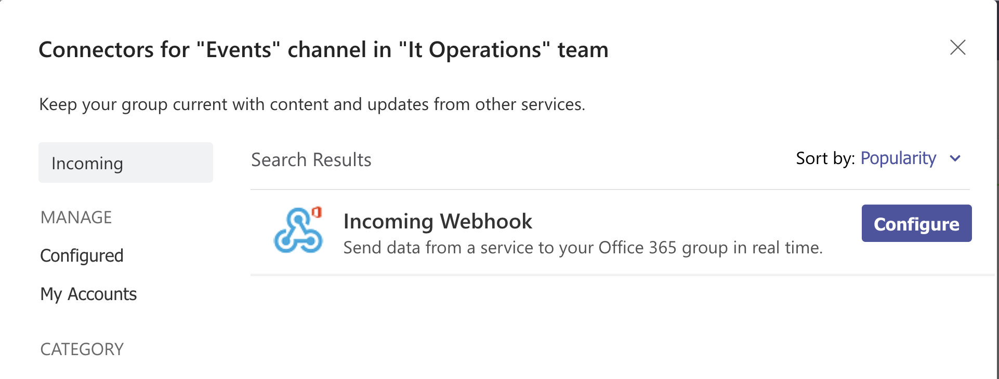
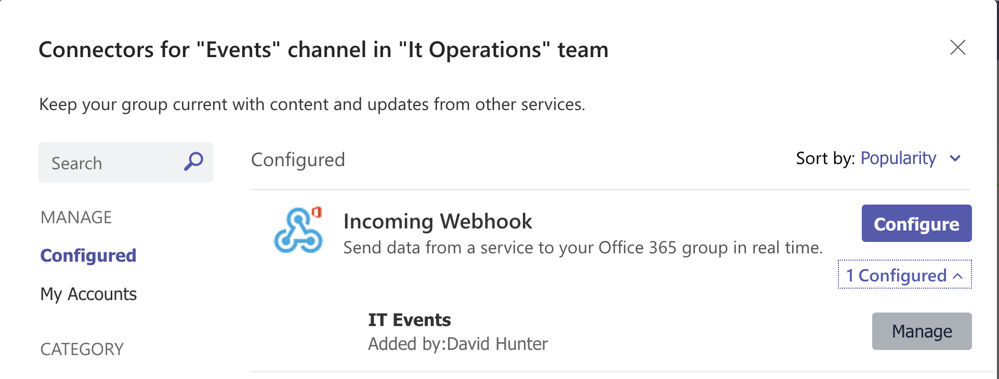
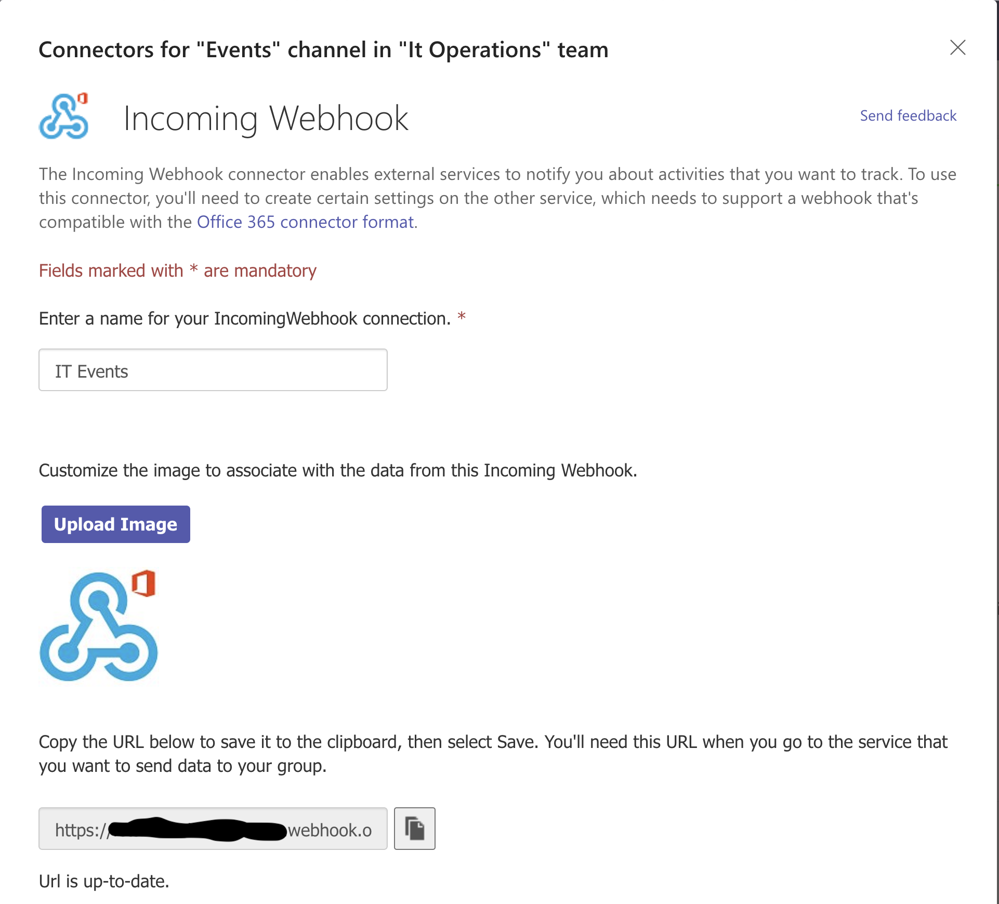

# Setups

[Microsoft Teams - Webhook](#teams)

[Wordpres - WP Webhooks Plugin](#wordpress)

## <a name="teams">Microsoft Teams - Webhook</a>

* Edit the teams channel connectors

* Search for and configure a new webhook

* Edit an existing Webhook

* Get the webhook URL

## <a name="wordpress">Wordpress - WP Webhooks Plugin</a>

Wordpress WP Webhooks Plugin install and configuration

1. Open Wordpress Admin and goto plugins
